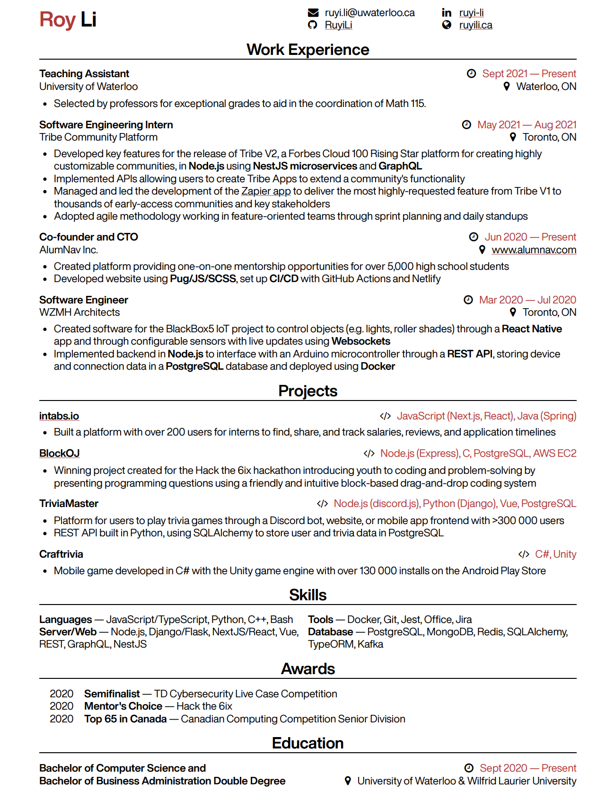
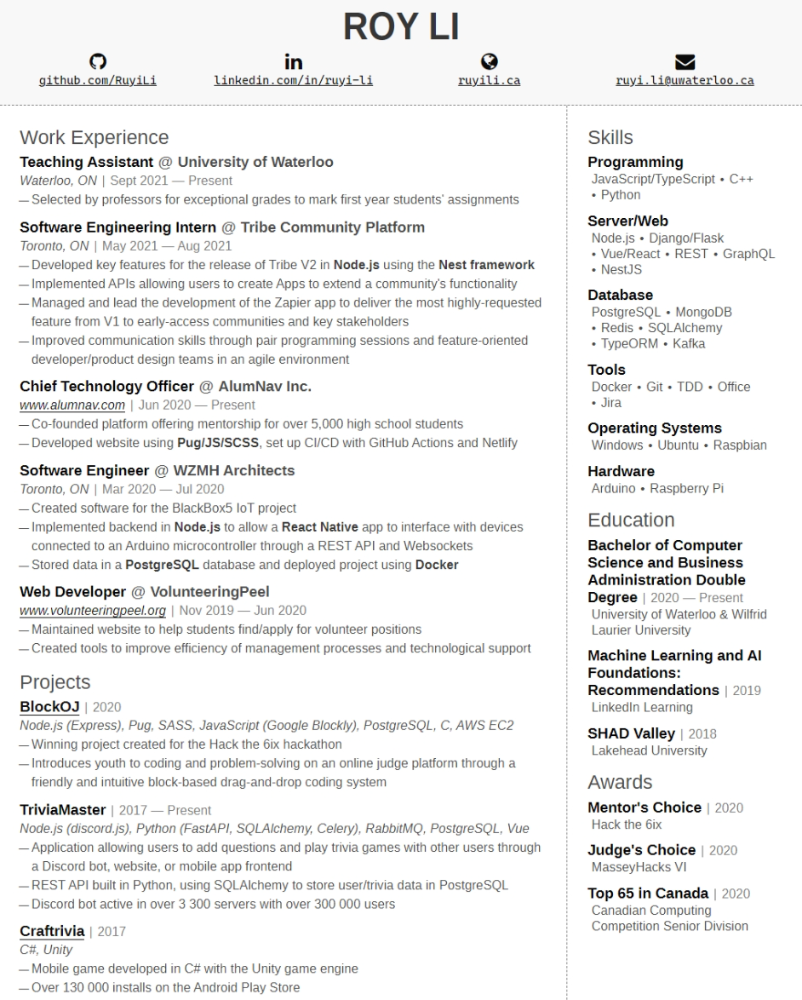

# resume

The source code for my resume.

## Setup

Fonts required for two-column version:

- Sans Serif
  - Liberation Sans
  - Helvetica Now Display
  - IBM Plex Sans
- Monospace
  - Cascadia Code

Fonts required for one-column version:

- Sans Serif
  - Helvetica Now Display
  - IBM Plex Sans
- Monospace
  - Cascadia Code

If you're forking your own version of this, you can change these to whichever fonts you want by modifying their respective variables in `(one-col|two-col)/style.scss`.

### Changing Templates

If you want to use the two-column template:

1. Open `index.html`
2. Comment out the first line
3. Uncomment the second line

and vice-versa for the one-column template.

## Generating PDF

To generate a PDF version of the resume, run `yarn dev`, go to http://localhost:3000, and run your browser's print command (usually done by pressing Ctrl+P). Then, select "Save as PDF" (or "Print to PDF").

## Previews

### One Column

### Two Column

